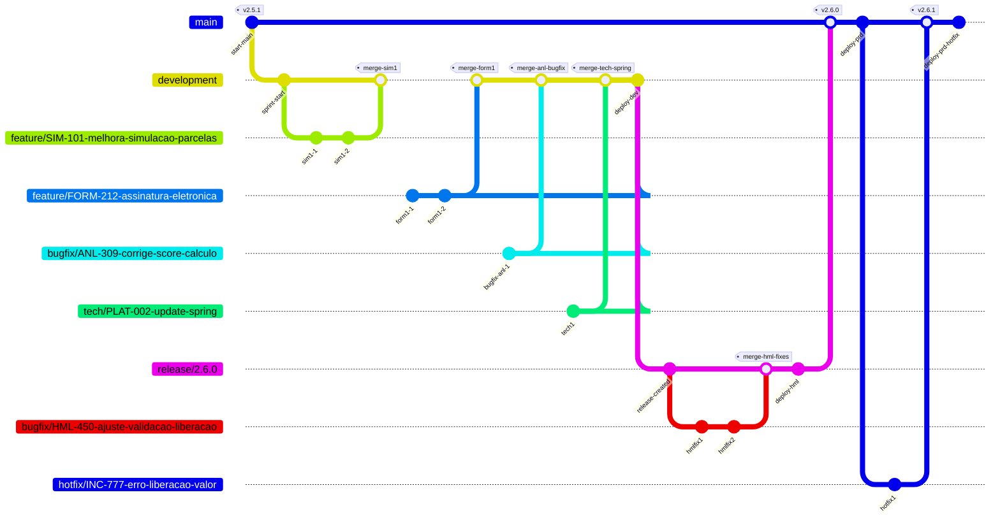

# Modelo de Branching – GitHub Flow com Branch Development

## Guia Operacional e Técnico Completo para Times Java / Spring Boot

Este documento descreve, em formato contínuo e detalhado, o modelo de branching adotado pela empresa, baseado em uma adaptação completa do GitHub Flow para equipes que trabalham com **sprints**, **Jira**, **GitHub Actions**, **ArgoCD** e **Kubernetes**.
O objetivo é estabelecer um processo simples, previsível e seguro para desenvolvimento, revisão, integração, testes, deploy e rollback.

Embora o GitHub Flow original utilize apenas a branch `main`, este modelo inclui também a branch `development` para atender cenários de QA, homologação e testes de sprint, sem comprometer a estabilidade da produção. Isso permite que o time continue utilizando práticas modernas de entrega contínua enquanto mantém rigor no controle de releases.

---

## Filosofia do Modelo

Todo o fluxo parte de uma premissa: **a branch `main` deve refletir sempre aquilo que está em produção**, enquanto a branch `development` reflete o estado consolidado da sprint que está sendo construída. Esse alinhamento permite prever exatamente em que estado o sistema se encontra, remover incertezas e manter rastreabilidade entre ambiente, branch e release.

Branches de trabalho são criadas para isolar mudanças, seja uma feature, correção ou melhoria técnica. Cada mudança deve ser pequena, revisável e testável. Essa granularidade reduz riscos e facilita revisão, depuração e rollback.

O processo é construído de forma declarativa: Git representa o estado desejado do software, e o ArgoCD garante que o Kubernetes esteja sincronizado com esse estado. Assim, toda implantação ou rollback é rastreável e auditável.

---

## Tipos de Branches e Propósitos

Para manter um fluxo claro, utilizamos apenas algumas categorias de branches:

| Branch          | Propósito                                                                | Deploy |
| --------------- | ------------------------------------------------------------------------ | ------ |
| **main**        | Linha de produção. Código estável e versionado. Sempre igual ao PRD.     | prd    |
| **development** | Consolidação da sprint. Recebe merges de features, bugfixes e melhorias. | dev    |
| feature/*       | Desenvolvimento de funcionalidades.                                      | —      |
| bugfix/*        | Correções encontradas em dev ou hml.                                     | —      |
| hotfix/*        | Correções emergenciais que devem ir imediatamente para produção.         | prd    |
| tech/*          | Refatores, upgrades de libs, melhorias técnicas.                         | —      |

Essa separação evita confusão e define claramente onde cada tipo de trabalho deve acontecer.

---

## Fluxo de Desenvolvimento de uma Feature

O desenvolvimento de uma funcionalidade segue um ciclo lógico. Primeiro, atualizamos nossa base local; depois, isolamos o trabalho; em seguida, desenvolvemos incrementalmente, garantindo testes e commits claros; finalmente, integramos à branch adequada através de um Pull Request.

O processo começa garantindo que sua `main` e `development` estejam sincronizadas com o repositório remoto:

```bash
git checkout main
git pull origin main

git checkout development
git pull origin development
```

Com isso feito, criamos a branch da feature, sempre atrelada a uma tarefa da sprint. A nomenclatura precisa refletir claramente o propósito:

```bash
git checkout -b feature/SIM-101-melhora-simulacao-parcelas
```

O desenvolvimento deve ocorrer de forma incremental. Em cada alteração, adicione somente o necessário e escreva commits pequenos, que expliquem exatamente a mudança realizada. Você pode usar commits curtos com `-m` ou commits completos ativando o editor de mensagem, especialmente quando precisar justificar um conjunto maior de alterações.

```bash
git add .
git commit -m "feat: adiciona cálculo revisado de parcelas"

git add .
git commit
# Editor será aberto; escreva um título e depois um corpo detalhado.
```

Ao finalizar um bloco de trabalho, envie sua branch para o GitHub:

```bash
git push -u origin feature/SIM-101-melhora-simulacao-parcelas
```

Feito isso, abra um Pull Request direcionado para `development`.
Esse PR deve conter:

* referência ao ticket,
* descrição da mudança,
* instruções de teste,
* riscos envolvidos,
* validação esperada.

Assim que o PR for aberto, a pipeline de CI executa automaticamente validações como compilação, testes, análise estática e verificação de segurança. Somente após CI verde e aprovação de review o merge pode ocorrer.

Com o merge concluído, a branch `development` passa a representar o estado consolidado da sprint, incluindo a feature recém-implementada. A cada merge, o ambiente **dev** recebe automaticamente uma nova versão, permitindo que QA e analistas já testem a sprint de forma incremental.

---

## Consolidação da Sprint e Criação da Release

Ao longo da sprint, várias features, bugfixes e melhorias técnicas são integradas à branch `development`. Esse ciclo de build contínuo mantém a branch sempre executável e testável, reduzindo incertezas ao final da sprint.

Quando todos os itens da sprint forem concluídos e devidamente testados em dev, criamos a branch de release:

```bash
git checkout -b release/2.6.0
```

Essa branch representa um congelamento do escopo.
Nenhuma nova funcionalidade deve entrar nela; apenas ajustes necessários para homologação.

Durante a homologação, se problemas forem encontrados, criamos branches de bugfix a partir da própria release:

```bash
git checkout -b bugfix/HML-450-ajuste-validacao-liberacao
```

Após aplicar as correções, fazemos merge de volta na branch da release e geramos nova versão para o ambiente hml. Esse ciclo continua até a aprovação.

---

## Deploy em Ambientes Dev, Hml e Prod

A implantação é feita via GitOps. Não executamos comandos manuais no cluster; tudo é acionado via Git + pipelines + ArgoCD. A lógica é a seguinte:

* merges em **development** disparam deploy no ambiente dev;
* merges ou atualizações na **release/** disparam deploy em hml;
* merges para **main** (ou criação da tag final) disparam deploy em produção.

O deploy ocorre sempre após edição automática do manifest no repositório GitOps e sincronização pelo ArgoCD.

---

## Publicação em Produção

Quando a release é validada, o passo final é integrá-la na branch principal:

```bash
git checkout main
git pull origin main
git merge release/2.6.0
```

E criar a tag da versão final:

```bash
git tag -a v2.6.0 -m "Release 2.6.0 homologada e aprovada"
git push origin v2.6.0
```

A partir desse momento, o repositório GitOps recebe a atualização de imagem correspondente e o ArgoCD implanta a release automaticamente em produção.

---

## Fluxo de Hotfix para Produção

Quando há um problema crítico em produção, o tempo de resposta deve ser mínimo. Um hotfix segue processo semelhante a uma feature, porém baseado no código que está rodando em produção.

Se `main` estiver sincronizada com produção:

```bash
git checkout main
git pull origin main
git checkout -b hotfix/INC-777-erro-liberacao-valor
```

Se `main` já contém códigos não liberados, criamos o hotfix a partir da tag da versão de produção:

```bash
git checkout v2.6.0
git checkout -b hotfix/INC-777-erro-liberacao-valor
```

Após implementar e testar:

```bash
git add .
git commit -m "fix: corrige erro na liberação de valor"
git push -u origin hotfix/INC-777-erro-liberacao-valor
```

Abrimos PR diretamente para `main`.
Após aprovado, mergeado e tagueado, o hotfix é implantado automaticamente em produção.

---

## Rollback com ArgoCD

Quando um deploy apresenta comportamento inesperado, o rollback deve ser imediato, preciso e seguro. O modelo GitOps evita intervenções diretas no cluster.

O rollback segue um processo simples:

1. Acessar a aplicação no ArgoCD.
2. Abrir "History and Rollback".
3. Selecionar o commit ou versão anterior.
4. Executar rollback.

O ArgoCD restabelecerá manifestos, image tags e configurações correspondentes àquele estado, aplicando todas as mudanças no cluster automaticamente.

---

## Diagrama do Modelo B (GitGraph com Deploys)


