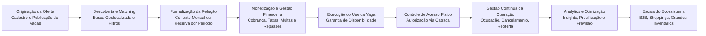

```mermaid
graph TD;
    A-->B;
    A-->C;
    B-->D;
    C-->D;
```

```mermaid
flowchart LR
    A[Originação da Oferta<br/>Cadastro e Publicação de Vagas] --> 
    B[Descoberta e Matching<br/>Busca Geolocalizada e Filtros] --> 
    C[Formalização da Relação<br/>Contrato Mensal ou Reserva por Período] --> 
    D[Monetização e Gestão Financeira<br/>Cobrança, Taxas, Multas e Repasses] --> 
    E[Execução do Uso da Vaga<br/>Garantia de Disponibilidade] --> 
    F[Controle de Acesso Físico<br/>Autorização via Catraca] --> 
    G[Gestão Contínua da Operação<br/>Ocupação, Cancelamento, Reoferta] --> 
    H[Analytics e Otimização<br/>Insights, Precificação e Previsão] --> 
    I[Escala do Ecossistema<br/>B2B, Shoppings, Grandes Inventários]

```
